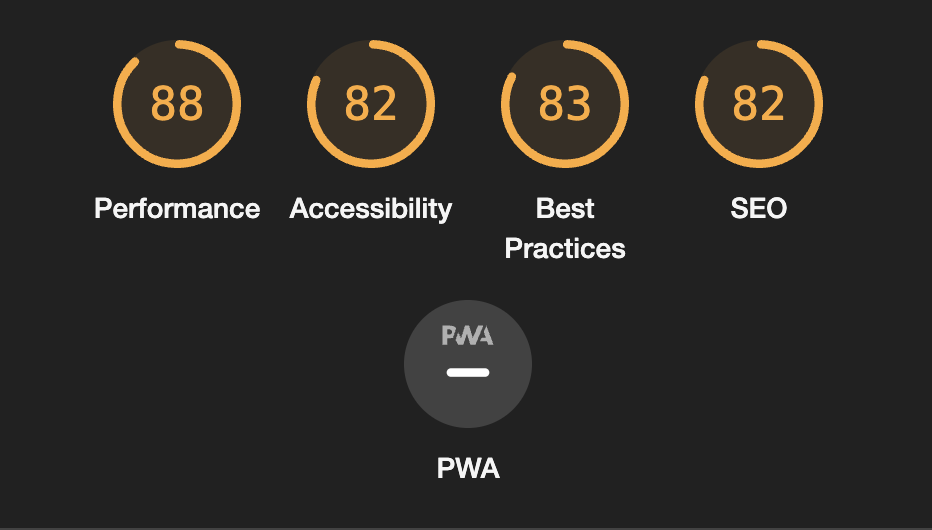
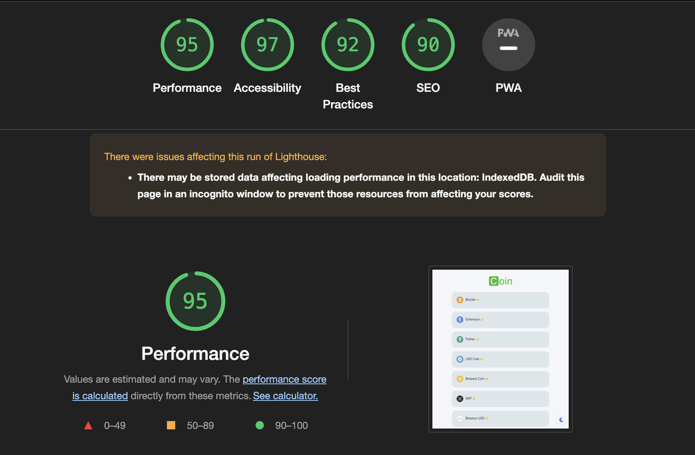

## Coin tracker

|       스택        |                        설명                        |
| :---------------: | :------------------------------------------------: |
|    typeScript     |          interface 상속, 제네릭, nullish           |
|     Router v6     | 객체 라우팅, nesting (children), Link Props(state) |
| styled-components |     theme provider, createGlobalStyle, nesting     |
|     ApexChart     |                  차트 라이브러리                   |
|    React-query    |       캐싱, fetcher, 실시간 데이터 업데이트        |
|      Recoil       |       atoms 상태 파편 , atoms 상태 업데이트        |

 

## 후기

- `타입스크립트`를 이용한 첫 토이 프로젝트라는 점
- `라우터를 객체 형식`으로 사용하는 방식이 엄청 편했다. (전에 쓰던 방식 컴포넌트 라우터는 헷갈렸음)
- `스타일 컴포넌트 사용`을 제대로 몰랐다는 점을 깨달았다. 함수처럼 상속한다는 점, Props로 전달하기, Theme 이용한 테마설정
- 비동기처리를 단순하게 해주는 `React-query`
- 전역 상태를 간단하게 표현하고 가져다 쓸 수 있는 `Recoil`

 

## 성능향상

